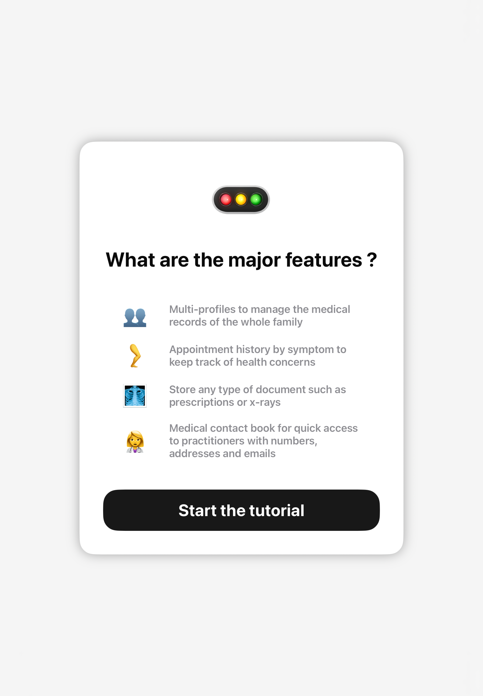
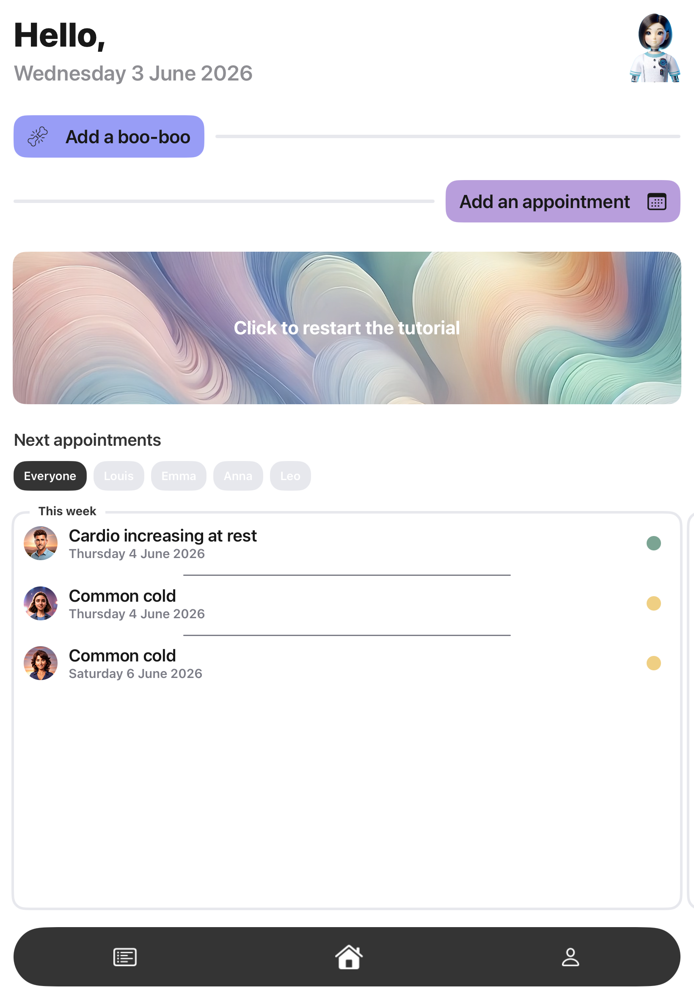
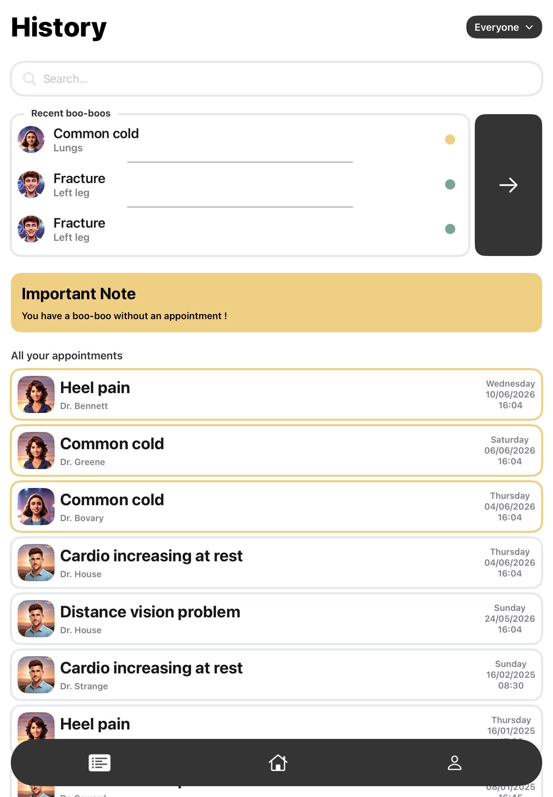
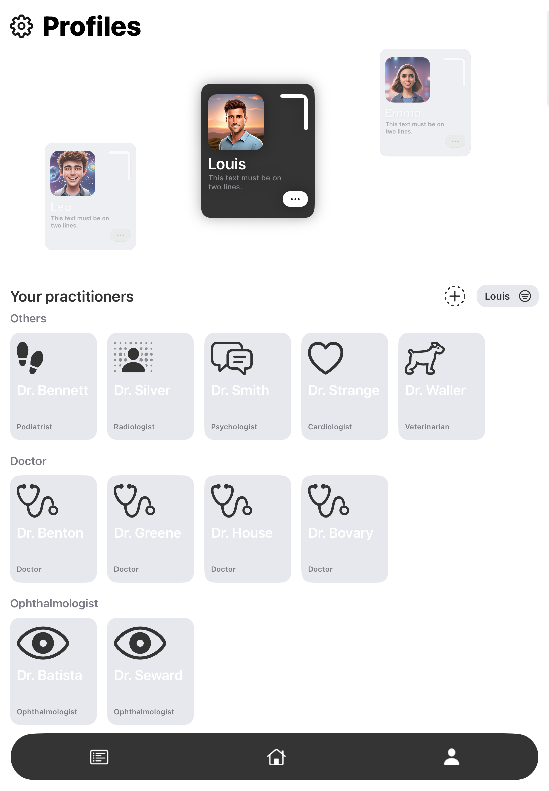

# Kara

> A family health tracker that keeps every medical appointment, condition, and practitioner in one place — for everyone under the same roof.

## Context
Swift Student Challenge 2025 — solo project, third year of engineering school.
Not the project I originally planned to submit (see [Bitforge](https://github.com/CharlesProducts/BitForge_SSC2025)). Built first as a personal app for my family, then adapted in a matter of weeks to meet SSC requirements. It won the challenge.

## What it does
- Organise appointments by **bobo** (a condition, injury, or illness) — every visit related to the same issue stays grouped together
- Build a complete, organised medical history across conditions and time
- Store documents — prescriptions, X-rays, any medical file — attached directly to appointments or bobos
- Medical contact book: practitioners listed with their phone number, address, and email for quick access
- Multi-user by design: one app for the whole family, with per-user filtering across every view

Three main screens:
- **Home** — add a new bobo or appointment; see what's coming up this week and next
- **Appointments & Bobos** — full history of visits and conditions, filterable by user
- **Practitioners** — the full contact book: every doctor, specialist, or therapist on record

## Stack
Swift · SwiftData · Swift Playgrounds · iPad

## My role
Everything: concept, design, and development. The app originated as an Xcode project backed by a real database. For SSC, I transposed it to a Swift Playground, replaced the database layer with SwiftData for full offline support, and redesigned the layout for iPad — all SSC submission requirements.

## Status
The SSC submission is the offline, iPad-optimised playground version. The original Xcode app — with a proper database backend — is still in development.

## Demo

<table>
  <tr>
    <td width="50%" align="center">
       
      <b>1 — Onboarding</b> 
      Introducing the app's main features.
    </td>
    <td width="50%" align="center">
       
      <b>2 — Home</b> 
      Add a new bobo or appointment, see upcoming appointments.
    </td>
  </tr>
  <tr>
    <td width="50%" align="center">
       
      <b>3 — History</b> 
      Appointments and bobos, browsable and filterable.
    </td>
    <td width="50%" align="center">
       
      <b>4 — Profiles &amp; Practitioners</b> 
      Manage family members and the medical contact book.
    </td>
  </tr>
</table>